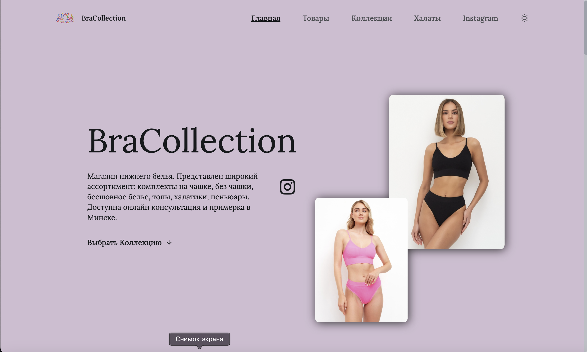
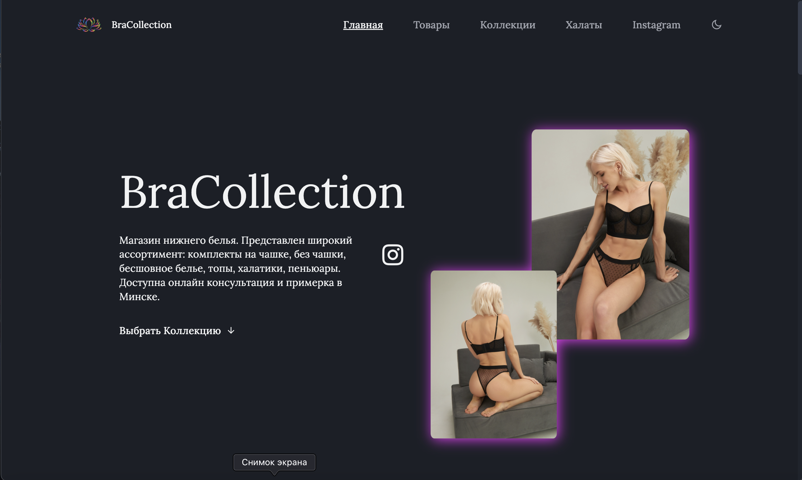
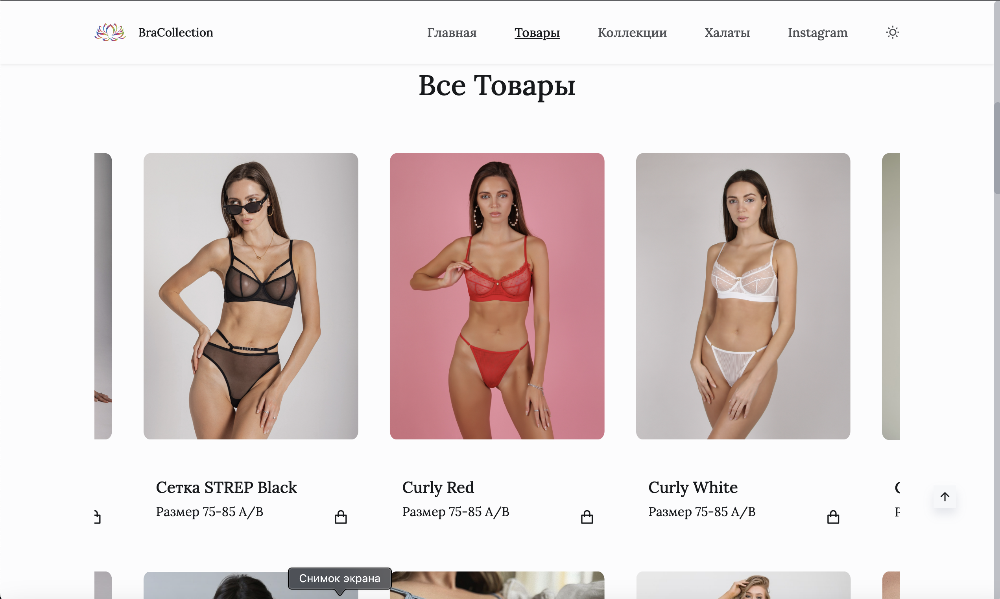
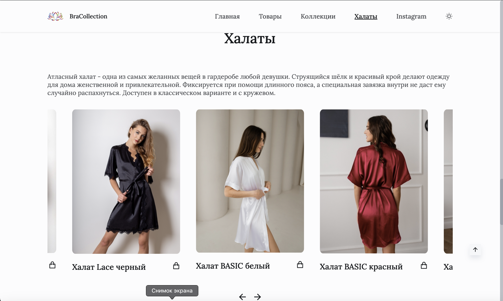
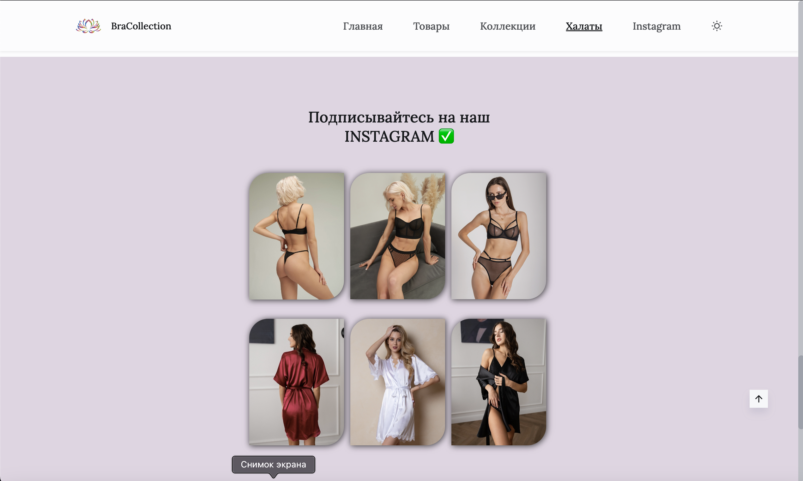
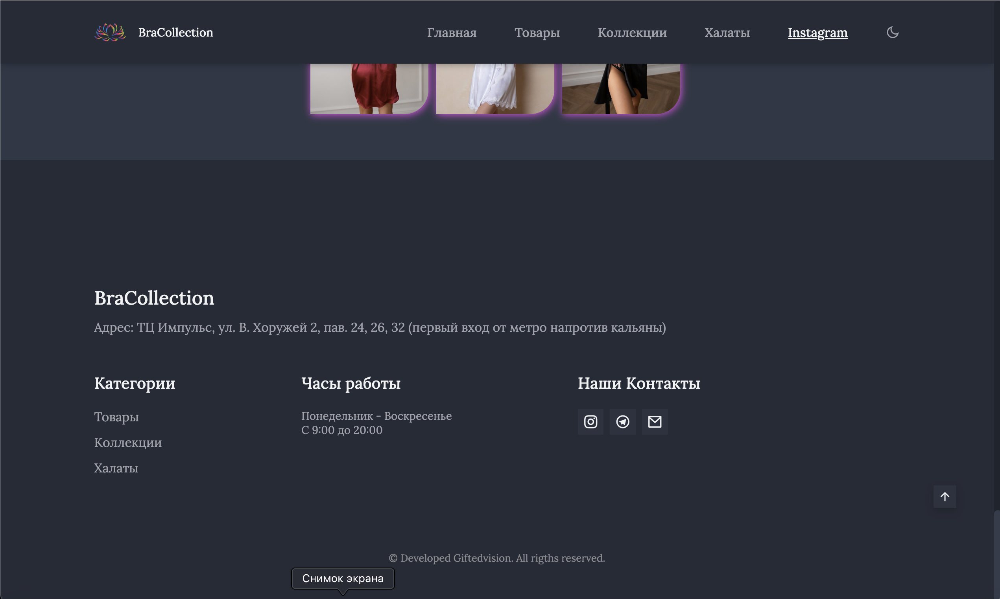

## Light Theme ☀️

      

 
 
## Dark Theme 🌚

      

      

## Main Theme

      

      

      

      

      

## Other Devices 📱

      
      

   
   
   

## Описание

Создание и разработка полноценного сайта для магазина женского белья BraCollection. Использование современных технологий веб-разработки. Смотрите другие мои работы!

## Запросы клиента

Клиент попросил изменить тему оформления сайта с дневного на ночной вид. Также при смене фона должна меняться титульная коллекция, для этого я задействовал параметр nth-child более подробно моджете ознакомиться в коде CSS. Для плавной прокрутки сайта я использовал scrollreveal с пользовательскими настройками. Для продукта swiper, swiper-bundle, настроив его в соответствии с общим стилем сайта.

## Description

Creation and development of a full-fledged website for the BraCollection lingerie store. Use of modern web development technologies. See my other works!

## Requests

The client asked to change the theme of the site from day to night. Also, when changing the background, the title collection should change, for this I used the nth-child parameter in more detail in the CSS code. For smooth scrolling of the site, I used scrollreveal with custom settings. For the swiper product, swiper-bundle by configuring it to match the general style of the site.

## View Work

- 👀 [
Просмотр работы](https://bracollection.netlify.app/)

## 💻 Developer

- [SvirkoAlexander](https://github.com/SvirkoAlexander)

## License 

Project https://bracollection.netlify.app is distributed under the MIT License.
